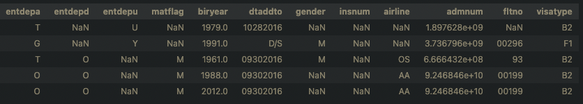
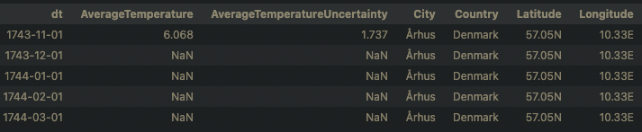
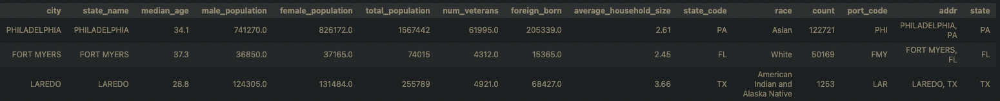
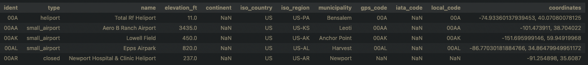

# Udacity Data Engineering Nanodegree Capstone Project
#### Table of Contents
- [Introduction](#introduction)

- [Initial Setup](#initial-setup)

- [How to Use](#how-to-use)

## Introduction
For my data engineering capstone project I developed a data pipline that creates an analytical database and supporting tables. Analytical database contains US immigration data populated on a monthly basis. Additional datasets are also available in staging tables. Insites can be drawn from main analytical tables or combining with other information tables provided. All tables are hosted in Amazon Redshift Databse and ETL/ELT pipeline was developed using Apache Airflow.

### Datasets
Following datasets were used to create analytical databse:
- I94 Immigration Data: This dataset comes from the US National Tourism and Trade Office. Each datafile contains monthly information on internationl visitors arrival. Data fields include information on arrival departure timeframe, citizenship country, residence country, arrival mode, and some traveller information such as birth year, age at arrival, occupation, gender etc. Each file contains 28 data colums and 3 million rows.

I94 immigration data sample:

- World Temperature Data: This kaggle dataset contrains city, country, latitude, longitude, average temperature, and temperature uncertainity data.

World temperature data sample:

- U.S. City Demographic Data: This dataset contains information about the demographics of all US cities and census-designated places with a population greater than or equal to 65,0000. Dataset comes from OpenSoft.

U.S. city demographic data sample:

- Airport Codes: This dataset contains data on airport codes and corresbonding cities. According to wikipedia, The airport codes may refer to either IATA airport code, a three-letter code which is used in passenger reservation, ticketing and baggage-handling systems, or the ICAO airport code which is a four letter code used by ATC systems and for airports that do not have an IATA airport code. 

Airport Codes data sample:

## Initial Setup

## How to Use
