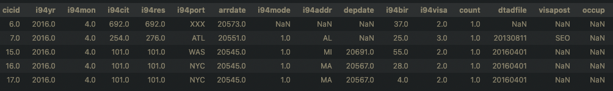
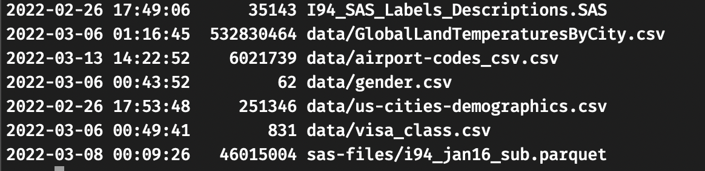
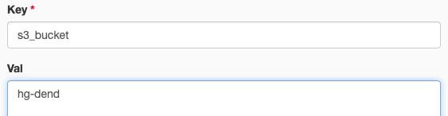
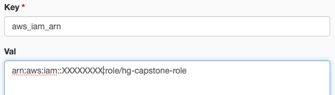
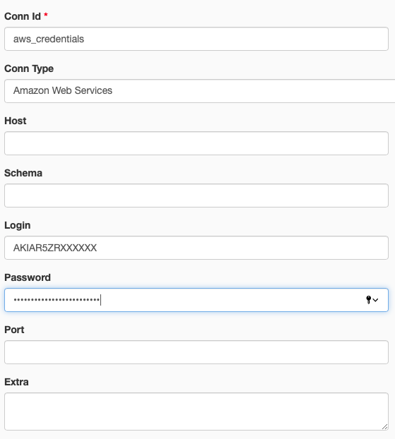
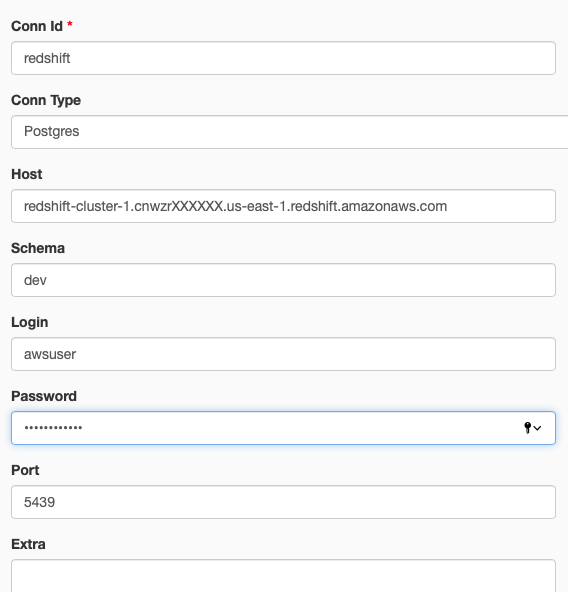

# Udacity Data Engineering Nanodegree Capstone Project
## Table of Contents

- [Introduction](#introduction)

- [Data Model](#data-model)

- [Airflow Data Pipeline](#airflow-data-pipeline)

- [Initial Setup](#initial-setup)

- [How to Use](#how-to-use)


## Introduction
For my data engineering capstone project I developed a data pipeline that creates an analytical database and supporting tables. Analytical database contain US immigration data populated on a monthly basis. Additional datasets are also available in staging tables. Insights can be drawn from main analytical tables or combining with other information tables provided. All data files are hosted in Amazon s3 bucket.  Tables are hosted in Amazon Redshift Database and ETL/ELT pipeline was developed using Apache Airflow.

### Datasets
Following datasets were used to create analytical database:
- I94 Immigration Data: This dataset comes from the US National Tourism and Trade Office. Each data file contains monthly information on international visitors arrival. Data fields include information on arrival departure time frame, citizenship country, residence country, arrival mode, and some traveller information such as birth year, age at arrival, occupation, gender etc. Each file contains 28 data columns and 3 million rows. Immigration data comes with a data dictionary that defines column contents of the main dataset which can be parsed and used in building the data model.


*I94 immigration data sample:*




- World Temperature Data: This kaggle dataset contains city, country, latitude, longitude, average temperature, and temperature uncertainty data.

 *World temperature data sample:*


- U.S. City Demographic Data: This dataset contains information about the demographics of all US cities and census-designated places with a population greater than or equal to 65,0000. Dataset comes from OpenSoft.

*U.S. city demographic data sample:*


- Airport Codes: This dataset contains data on airport codes and corresponding cities. According to wikipedia, The airport codes may refer to either IATA airport code, a three-letter code which is used in passenger reservation, ticketing and baggage-handling systems, or the ICAO airport code which is a four letter code used by ATC systems and for airports that do not have an IATA airport code. 

*Airport Codes data sample:*


- Manually Collected Data: Additional datasets describing gender definitions, and visa classes were collected through online research. These datasets improves the capabilities of main analytical database.


## Data Model
U.S. Immigration analytical database has a star schema with one fact table and multiple dimension tables. Dimension tables are directly populated through truncate, copy pattern or special operator that parses and loads the data. Dimension tables are relatively small in size. Consequently, truncate-copy pattern is a reasonable way to to maintain idempotent data pipeline without compromising the performance. Dimension tables are distributed across all nodes for faster query performance. Immigration dataset is first loaded into staging a staging table, which will then be cleaned and populates that fact table.

Additional datasets containing world temperature, US city demographics, and airport codes can be combined with main database to answer various analytical questions. These datasets are loaded into staging tables, cleaned and transformed into more analytical friendly formats.

Database schema is shown below:


## Airflow Data Pipeline

Following custom operators were developed for loading datasets from s3 bucket to RedShift, cleaning, and validation. 

- SASfileToRedshiftOperator : Parse and load tables from SAS data dictionary to Redshift.
- S3ToRedshiftOperator : Load files in CSV or Parquet format to Redshift using copy command.
- LoadFactOperator : Clean and load immigration fact table from staging table.
- CleanTablesOperator : Perform various data cleanup operations, for example fill null values, convert from string to numeric format etc.
- DataQualityOperator : Performs data quality checks to ensure tables are populated without errors using pre-defined set of queries and expected result.

Airflow data pipeline is shown below:


## Initial Setup
Make sure docker is installed and working properly.

- Load data files to s3 bucket using following key, value structure. Alternatively, use the data in ```hg-dend``` bucket located in aws region us-east-1.

    

- Create Amazon Redshift cluster. Allow outside access. Configure redshift and security groups for outside access. Create an iam role with s3 read permission then assign role to redshift cluster.

- Create and configure dwh.cfg file based on following format. File should be located in the main project directory.
    ```bash
    [CLUSTER]
    HOST=redshift-cluster-1.XXXXXXX.us-east-1.redshift.amazonaws.com
    DB_NAME=dev
    DB_USER=awsuser
    DB_PASSWORD=YourPassword
    DB_PORT=5439

    [IAM_ROLE]
    ARN=arn:aws:iam::XXXXXXXXXX:role/hg-capstone-role
    ```
- Create a virtual environment and install dependencies.
    ```bash
    $ python3 -m venv .venv
    $ source .venv/bin/activate
    (.venv) $ pip install -r requirements.txt
    ```

- Run Airflow from airflow directory.
    ```bash
    docker compose up -d
    ```
- Access airflow UI from the web browser```localhost:8080```

- Create Airflow variables and connections shown below:

    1. Create s3 bucket airflow variable

        

    1. Create aws iam role variable

        

    1. Create connection with aws access key id and secret access key

        
    
    1. Create redshift connection

        


## How to Use

1. Create Redshift tables.
    ```bash
    python create_tables.py
    ```
1. Run `etl-dag` in Airflow UI